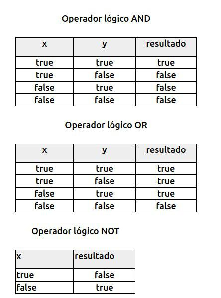

# Día 3

## Temario

* Repaso
* Qué es Javascript.
* Explicar variables, por encima la diferencia entre objeto y valor (necesario para entender qué pasa cuando laburan con el DOM)
* Estructuras de control
* Operadores lógicos
* Operadores aritméticos
* Operadores de comparación


## Cronograma

### 19:00 ~ Repaso

### 19:15 ~ Qué es JS

Un poco de historia. 1995 Brendan Eich toma varios conceptos de lenguajes modernos (Python, Scheme, Perl) y lo arma en 10 días. Aparece como LiveScript en septiembre de 1995 en una beta y luego es renombrado a JavaScript, lo que fue una movida de marketing a la luz del éxito que ya tenía Java en la web. JavaScript no tiene relación con Java.

### 19:30 ~ Variables.

Una variable es una etiqueta a una caja. Le asignamos un valor y lo guarda, luego podemos operar con ese valor.

### 19:40 ~ Operadores lógicos

Empezaría mostrando y explicando las tablas de verdad.



 AND, OR y NOT

### 19:50 ~ Operadores aritméticos

Sirven para hacer cuentas (dicho en criollo).

+ (suma), - (resta), * (multiplicar), / (dividir), % (módulo- sobra de división)

Math.pow(base, exponente) [potencia de un número]

Math.sqrt(base) [raíz cuadrada]

[doc de mozilla](https://developer.mozilla.org/es/docs/Web/JavaScript/Referencia/Objetos_globales/Math)

### 20:00 ~ Operadores de comparación

===, !==, <=, >=

### 20:10 Estructuras de control

if () {} else {} (si la afirmación que está entre paréntesis es verdadera, pasa lo primero. Si es falso pasa lo que está después del else)

```javascript
switch(variable) {
  case valor:
    console.log("que pasa");
    break;
  case valor2: ;
    console.log("pasa esto otro");
    break;
  default:
    console.log("Si no se cumple ninguno de los otors case");
 }
```

```javascript
for (i = 0; i<10; i++) {
  //el código que aparece después se repetirá 10 veces
  console.log(i);
} (ciclo que se va a repetir según ciertas condiciones)
```

** while(){} (se repite lo que se cicla siempre y cuando la condición se cumpla)

** do {} while() (la diferencia con while es que en esta forma, lo que queremos se ejecuta alguna vez por lo menos.)

### 20:30 ~ Funciones y scopes

¿Qué es una función? Unidad mínima de código reutilizable. Sintaxis, parámetros. Ejemplos.

¿Qué es un scope? Bloque (código entre llaves) dentro de la función donde las variables definidas quedan atrapadas.

**Ejemplo**

```javascript
function mostrarMucho(mensaje,repeticion){
  var i;
  for (i=0;i<repeticion;i++){
    console.log(mensaje);
  }
}

mostrarMucho('Hola',10);
alert(i);
```


Si por fuera de la función hacemos un llamado a saber el valor de "i" va a decir que es *undefined* porque esa variable no existe por fuera de la función.

¿Qué es el scope global? El bloque general de ejecución del código. No es recomendable declarar las variables en este espacio porque es muy fácil pisarlas sin querer (algunos ejemplos)


### 20:50 ~ Objetos y DOM

¿Qué es un objeto? Asiganción por referencia y no por copia. ¿qué diferencia una propiedad de un método?

**Ejemplo**

```javascript
var persona = {
  nombre: 'Juan';
  edad: 25;
}
```

```javascript
persona.saludar = function(){
  console.log("hola "+this.nombre);
}
```

Lo importante es que dentro de JavaScript tenemos un objeto global llamado *document* donde está representada toda nuestra página web.

**Ejemplo**

```html
<div id="contenedor">

</div>
```

var contenedor = document.getElementById("contenedor");
contenedor.innerHTML = "<strong>algo</strong>";

Diccionario como expresión mínima de un objeto. Ejemplos que muestren bien claro la diferencia entre tener 2 referencias a un objeto y 2 variables con 2 valores.

El DOM es la representación del documento HTML de una manera que podemos usar desde Javascript. Nos permite leerlo, modificarlo y subscribirnos a las interacciones del usuario sobre él.

Ejemplos con document.body, document.head, document.getElementById().


### Eventos

```html
<button id="boton">
  clikeame
</button>
```

```javascript
var btn = document.getElementById("boton");
var i = 0;
btn.onclick = function(event){
  alert(i);
  i++;
}
```
